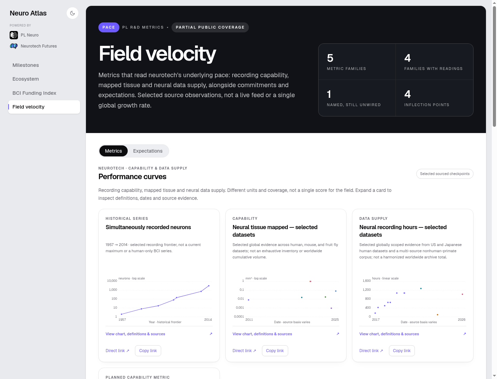
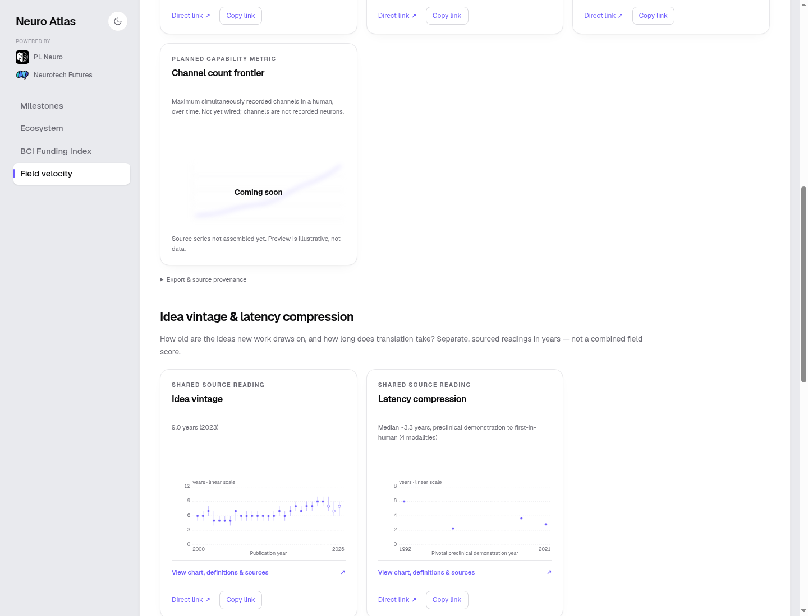
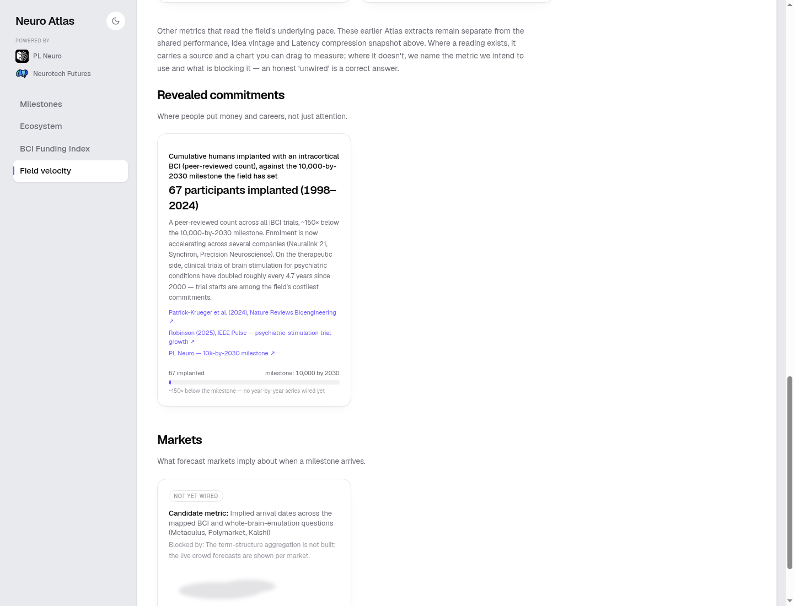
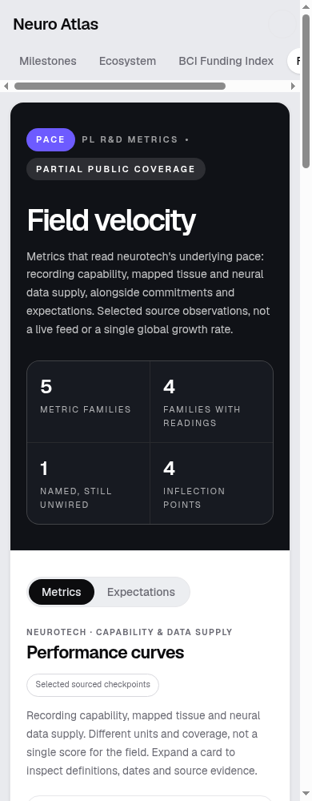

# Metrics layout follow-up — verification

Application revision: `750a3ccc7b078a9344afee96406717d4894cc040`. Later commits in this follow-up add documentation/screenshots only.

- Revealed commitments and Markets now reuse the same section header treatment as Performance curves and Idea vintage & latency compression.
- Every desktop Metrics grid has exactly three tracks, including sections with one or two cards. Channel count frontier is the fourth Performance card, starting a new row and retaining two empty slots.
- The Channel count preview is blurred, labeled Coming soon, noninteractive, and explicitly illustrative—not observations.
- Data/source definitions and hosted authentication are unchanged.

## Evidence

Parent review: **PASS** for this layout change. Real headed Chrome at 1440px confirmed four section headers, four three-track grids, and one noninteractive placeholder with computed `blur(4px)`. First and fourth Performance cards share the same X coordinate and width. The two pace cards leave the third track empty; commitments and Markets each occupy one track.

`node --import tsx --test --test-concurrency=1 tests/metrics-layout.test.mjs`: 3/3 pass.

The full modal browser matrix also passed at 1440, 390 and 320px for all five wired charts: fresh URLs, native clipboard readback, Direct link, source-point counts, focus wrap/restore, Close/Escape/backdrop, and Back/Forward without background scroll or geometry changes. Cross-group history and hidden-Metrics-tab recovery passed.

Screenshots were captured from an isolated local checkout at the application revision, with a **test-only, loopback-only authentication fixture**. They verify UI behavior, not hosted sign-in. The fixture is not part of the PR and must never be deployed.

